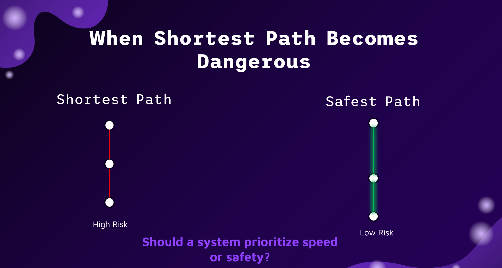
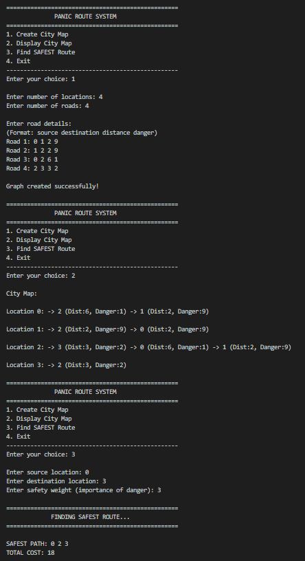

# 🚨 Panic Route System

<h3>Risk-Aware Pathfinding using Modified Dijkstra Algorithm</h3>

<h2>📌 Overview</h2>

The <b>Panic Route System</b> is a graph-based pathfinding solution implemented in C that computes the <b>safest route between locations</b> by incorporating risk (danger levels) into decision-making.

Unlike traditional shortest-path algorithms that minimize distance, this system prioritizes <b>safety over distance</b>, making it suitable for emergency evacuation and high-risk navigation scenarios.

<h2>📸 Visual Demonstration</h2>

<h3>🧠 Concept: Shortest vs Safest Path</h3>

<h3>💻 Program Execution (CLI Output)</h3>

<i>The system selects a safer path (0 → 2 → 3) despite a shorter but riskier alternative.</i>

<h2>🎯 Problem Statement</h2>

In real-world situations such as emergencies, the shortest path is not always the safest.

This project focuses on finding an optimal route that balances <b>distance and risk</b> for safer navigation.

<h2>🧠 Key Idea</h2>

<pre>
Cost = Distance + (Danger × Weight)
</pre>

<ul>
<li><b>Distance</b> → Length of path</li>
<li><b>Danger</b> → Risk level (0–10)</li>
<li><b>Weight</b> → Importance given to safety</li>
</ul>

This allows the system to dynamically prefer safer routes over shorter ones.

<h2>⚙️ Features</h2>
<ul>
<li>📍 Graph representation using <b>Adjacency List</b></li>
<li>🚧 Each edge stores <b>distance + risk</b></li>
<li>🧮 Modified <b>Dijkstra Algorithm</b></li>
<li>⚡ <b>Min Heap (Priority Queue)</b> optimization</li>
<li>🎛️ Adjustable <b>risk-weight parameter</b></li>
<li>📊 Menu-driven CLI interface</li>
<li>⚠️ Input validation</li>
</ul>

<h2>🏗️ Tech Stack</h2>
<ul>
<li><b>Language:</b> C</li>
<li><b>Concepts:</b> Graphs, Heaps, Dijkstra Algorithm</li>
<li><b>Data Structures:</b>
  <ul>
    <li>Adjacency List</li>
    <li>Min Heap</li>
    <li>Arrays (dist[], parent[], visited[])</li>
  </ul>
</li>
</ul>

<h2>🔄 Algorithm Comparison</h2>

<table border="1" cellpadding="6">
<tr>
<th>Algorithm</th>
<th>Optimization Target</th>
</tr>
<tr>
<td>Traditional Dijkstra</td>
<td>Shortest Distance</td>
</tr>
<tr>
<td>Modified Dijkstra</td>
<td>Risk-Adjusted Cost</td>
</tr>
</table>

✔ Enables safer decision-making in critical scenarios

<h2>⚡ Time Complexity</h2>

<table border="1" cellpadding="6">
<tr>
<th>Approach</th>
<th>Complexity</th>
</tr>
<tr>
<td>Basic Dijkstra</td>
<td>O(V²)</td>
</tr>
<tr>
<td>Heap-based Dijkstra</td>
<td>O(E log V)</td>
</tr>
</table>

✔ Modification does not increase complexity

<h2>🧪 Example</h2>

<h3>Input Graph</h3>
<pre>
0 --(2,9)-- 1
1 --(2,9)-- 2
0 --(6,1)-- 2
2 --(3,2)-- 3
</pre>

<h3>Sample Input</h3>
<pre>
4
4
0 1 2 9
1 2 2 9
0 2 6 1
2 3 3 2
</pre>

<h3>Output</h3>
<pre>
Safest Path: 0 → 2 → 3
Total Cost: 15
</pre>

<b>Insight:</b> The shortest path is avoided due to higher risk, demonstrating the effectiveness of the modified algorithm.

<h2>📁 Project Structure</h2>

<pre>
panic-route-system/
├── src/
│   ├── main.c
│   ├── graph.c
│   ├── heap.c
│   ├── dijkstra.c
│   └── risk.c
├── include/
│   ├── graph.h
│   ├── heap.h
│   ├── dijkstra.h
│   └── risk.h
├── input/
│   └── sample.txt
├── docs/
│   └── Project_Report.pptx
├── assets/
│   ├── concept.png
│   └── output.png
├── README.md
└── .gitignore
</pre>

<h2>▶️ How to Run</h2>

<pre>
gcc src/*.c -o panic
./panic
</pre>

<h2>🚀 Applications</h2>
<ul>
<li>Emergency evacuation systems</li>
<li>Disaster management</li>
<li>Military route planning</li>
<li>Smart navigation systems</li>
</ul>

<h2>🧠 Key Insight</h2>

<b>We didn’t change Dijkstra’s algorithm — we changed what it optimizes.</b>

<h2>📸 Future Improvements</h2>
<ul>
<li>Add graphical visualization</li>
<li>Integrate real-time data</li>
<li>Build GUI/Web interface</li>
</ul>

<h2>👨‍💻 Author</h2>

<b>Priyank Sinha</b> 
B.Tech CSE | UPES

